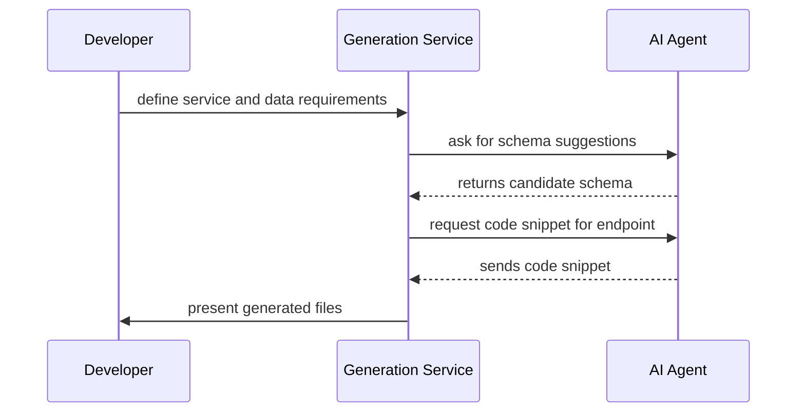

# AI Agent Integration

Forge can work with AI-powered services to enrich generation capabilities. Possible roles:

- **Schema Synthesis** – propose data models or service endpoints based on textual descriptions.
- **Code Suggestion** – fill in function bodies or offer test case scaffolds.
- **Review/Refinement** – provide feedback and improvements on generated code before finalization.

## Example Interaction Flow



## Pseudocode Snippet

```python
from forge.agents import ChatAgent
from forge.templates import ServiceTemplate

agent = ChatAgent(model="gpt-4")
proposal = agent.propose_schema(description="todo list api")
service = ServiceTemplate(name="todo", schema=proposal)
service.write_to("generated/todo_service")
```
