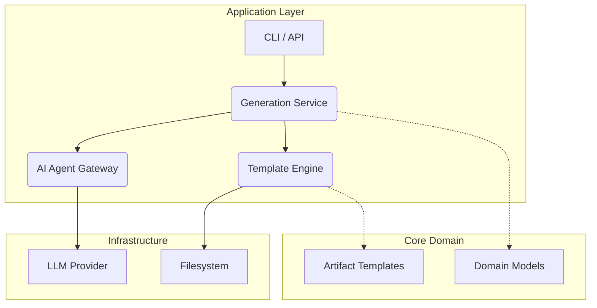

# High Level Architecture Ideas

## Domain Driven Design Approach

Forge can be structured around Domain Driven Design (DDD) concepts:

- **Core Domain** – responsible for the fundamental building blocks of code generation: schema modelling, artifact definitions and templates.
- **Application Layer** – orchestrates code generation workflows, interacts with AI agents, and applies domain services.
- **Infrastructure Layer** – file system interactions, external tools and runtime environment management.

### Conceptual Component Diagram

### Key Principles

1. **Separation of Concerns** – keep generation logic isolated from infrastructure and UI concerns.
2. **Extensibility** – provide plug points for new AI agents, templates, or generators.
3. **Idempotency** – generating code multiple times should produce consistent results, avoiding overwriting manual edits.
