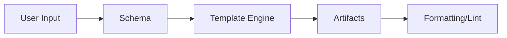

# Code Generation Process

The generation workflow could involve several stages:

1. **Input Gathering** – The user specifies requirements via CLI, API, or configuration file.
2. **Schema Creation** – Forge or an AI agent proposes a schema (data models, service endpoints, etc.).
3. **Template Selection** – Based on the schema, appropriate templates are chosen.
4. **Artifact Rendering** – Templates are filled with schema details and agent-generated snippets.
5. **Post-Processing** – Formatting and linting, plus optional human review.



## Example Configuration (YAML)

```yaml
todo_service:
  language: python
  models:
    - name: Task
      fields:
        - title: str
        - completed: bool
  endpoints:
    - path: /tasks
      method: GET
```

## Simplified Generator Snippet

```python
def generate_service(config):
    models = parse_models(config)
    templates = load_templates(language=config['language'])
    for model in models:
        render_model(model, templates['model'])
```
